# Linux Virtualization Exercise - Part 1

## Introduction to Virtualization Concepts

### Key Concepts

- **Virtualization**: The process of creating virtual instances of computing resources, such as operating systems, servers, or networks.
- **Hypervisor**: A software layer that allows multiple virtual machines (VMs) to run on a single physical machine.
- **Virtual Machines (VMs)**: Fully isolated environments with their own operating systems, system libraries, and resources.
- **Containers**: Lightweight, process-level virtualization that shares the host OS kernel while isolating applications.
- **VMs vs. Containers**: VMs are heavier, require a full OS, and provide stronger isolation, while containers are lightweight, share the OS kernel, and start faster.

---

## **Comparison: Virtual Machines vs. Containers**

| Feature            | Virtual Machines (VMs)                                      | Containers                                         |
|--------------------|-------------------------------------------------------------|---------------------------------------------------|
| **Architecture**   | Run a full OS on a hypervisor, each VM has its own kernel, system libraries, and dependencies. | Share the host OS kernel, using container runtimes (like Docker) for lightweight process isolation. |
| **Resource Utilization** | Require more system resources since they each have a dedicated OS and virtual hardware (CPU, memory, storage). | Use fewer resources because they share the host OS, leading to faster startup times and better efficiency. |
| **Isolation Levels** | Offer strong isolation as each VM operates independently with its own OS, making them more secure but heavier. | Provide process-level isolation within the same OS, making them lightweight but with a slightly higher risk of security vulnerabilities. |

---

# Part 2: Working with Multipass

## Introduction
**Multipass** is a command-line tool that allows you to quickly create and manage Ubuntu virtual machines.

---

### **Basic Commands**

| Command              | Description |
|----------------------|-------------|
| `multipass launch`  | Launch the default Ubuntu instance. |
| `multipass list`    | Lists all running instances. |
| `multipass info <instance>` | View details about a specific instance. |
| `multipass shell <instance>` | Access the shell of a running instance. |
| `multipass exec <instance> -- <command>` | Run a command on the instance. |
| `multipass stop <instance>` | Stop the running instance. |
| `multipass delete <instance>` | Delete an instance. |
| `multipass purge` | Remove deleted instances permanently. |

---

## **Cloud-Init Configuration**
### **What is Cloud-Init?**
Cloud-Init is a tool used for automating the initial setup of virtual machines. It allows configuration of users, package installations, and networking.

### **Experiment: Customizing a Multipass Instance**
Create a `cloud-init.yaml` file with the following content:

```yaml
#cloud-config
users:
  - name: devuser
    sudo: ALL=(ALL) NOPASSWD:ALL
    shell: /bin/bash
    ssh-authorized-keys:
      - ssh-rsa AAAA...

packages:
  - git
  - curl
  - htop
  - vim
```

launch a new instance using this configuration:

```
multipass launch --name custom-vm --cloud-init cloud-init.yaml
```

---

## **File Sharing**
### **How to Share Files Between Host and Multipass Instance**
Multipass allows mounting host directories inside instances.

#### **Example: Mounting a Shared Folder**
```
multipass mount ~/shared-folder custom-vm:/mnt/shared
```
Inside the Multipass instance, access the shared folder:
```
cd /mnt/shared
```

To unmount the shared folder:
```
multipass umount custom-vm:/mnt/shared
```

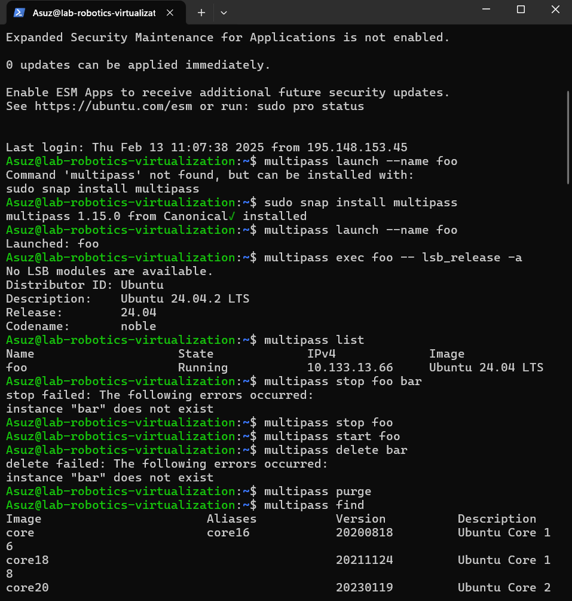
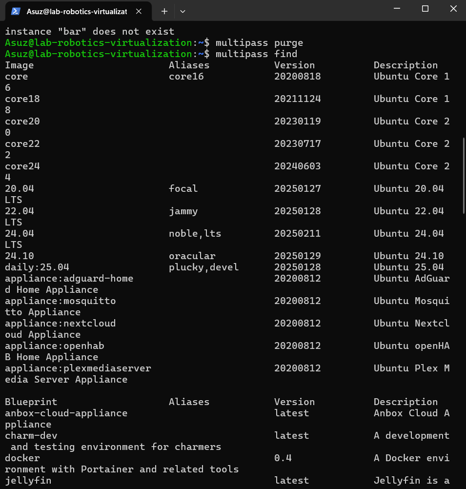
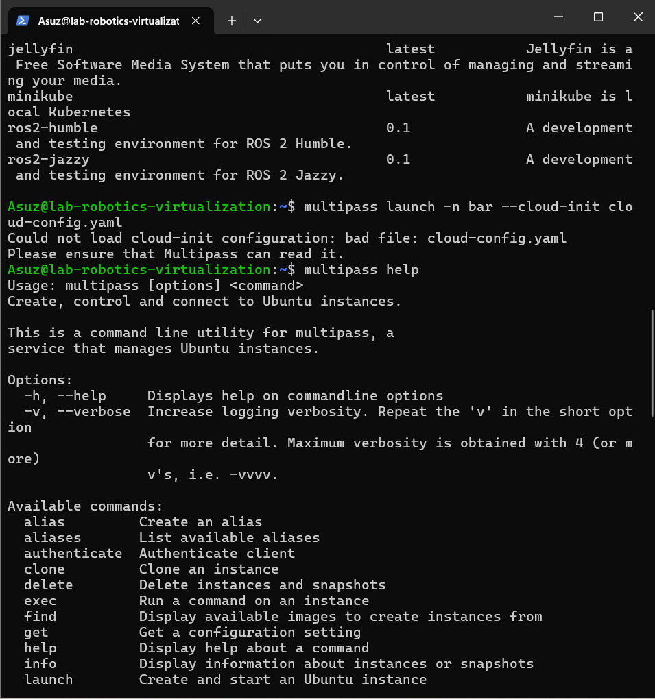
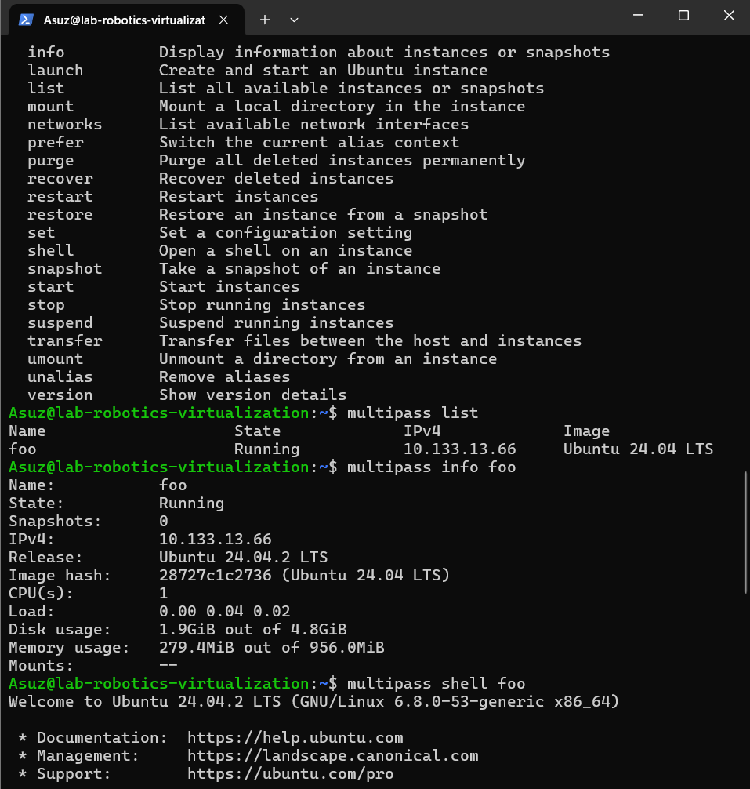
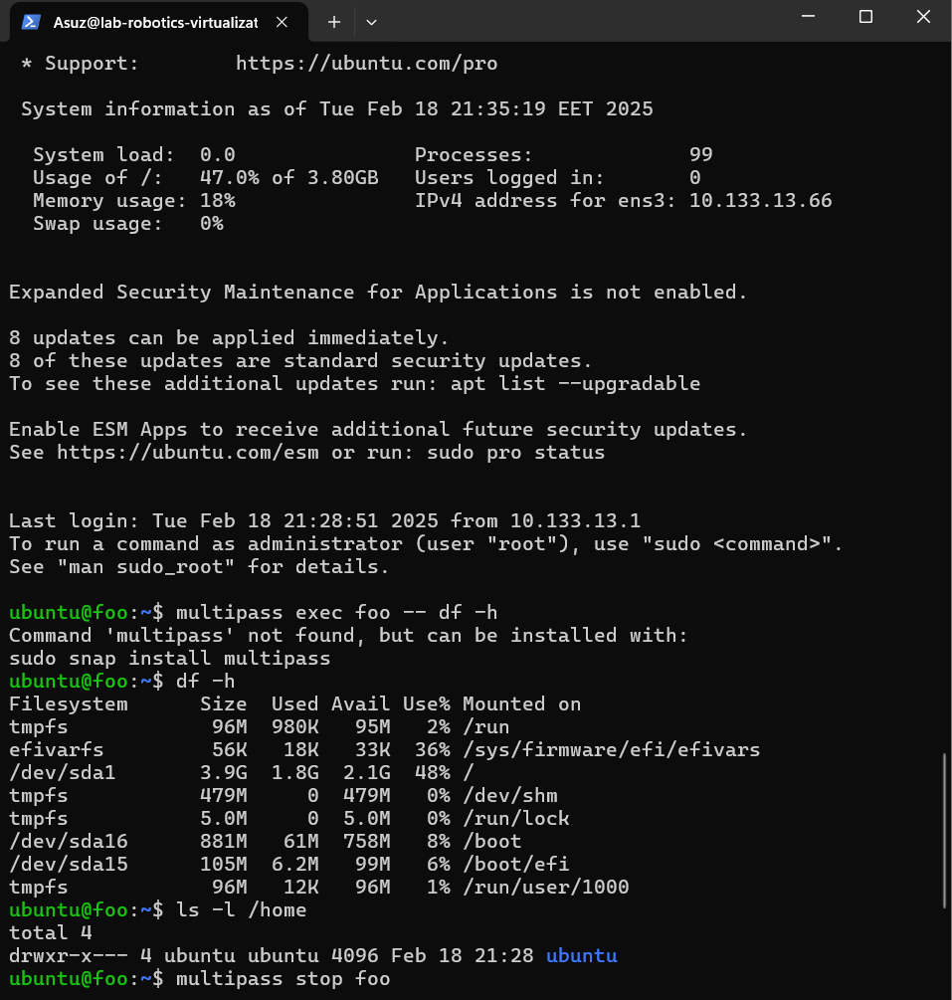
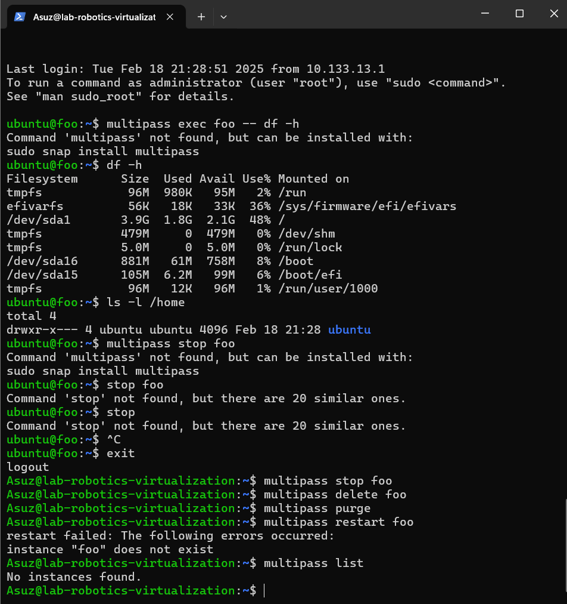

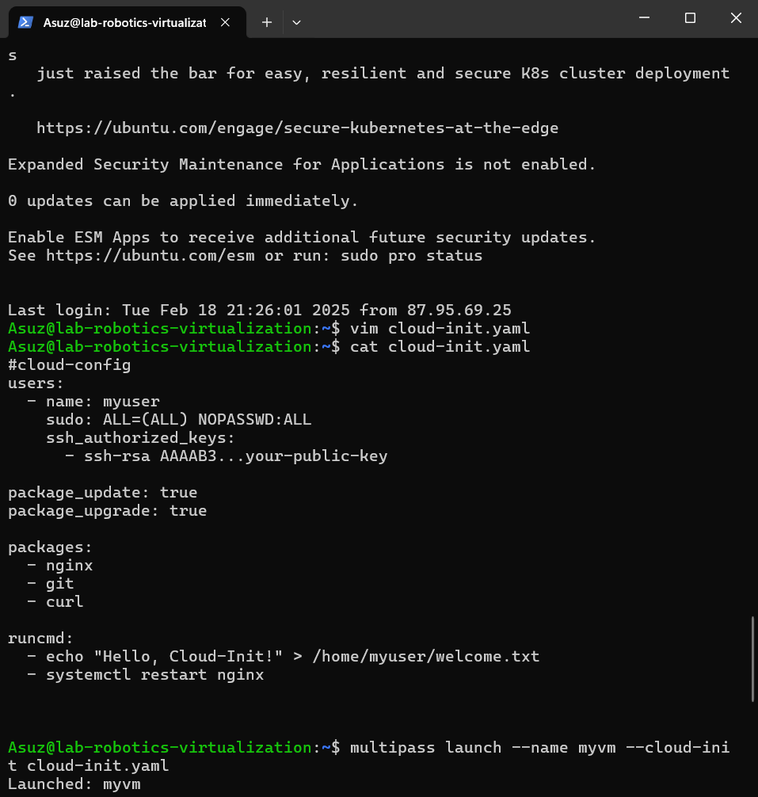


````
Policy: Create a shared folder and access it from both your host and your Multipass instance.
````


----
# Part 3: Exploring LXD

## **Introduction**
**LXD** is a container and virtual machine management tool built on **LXC**. It provides a **lightweight, fast, and secure** way to run system containers and virtual machines on Linux.

---

## **Setup: Installing and Enabling LXD**
To install LXD, run the following commands:

```
sudo apt update
sudo apt install lxd -y
```

After installation, initialize LXD:

```
lxd init
```
---

## **Basic LXD Commands**
### **1. Create and Manage Containers**
| Command | Description |
|---------|-------------|
| `lxc launch ubuntu:22.04 my-container` | Create a new container using Ubuntu 22.04. |
| `lxc list` | List all running containers. |
| `lxc stop my-container` | Stop a running container. |
| `lxc start my-container` | Start a stopped container. |
| `lxc delete my-container` | Delete a container. |

---

### **2. Interacting with Containers**
| Command | Description |
|---------|-------------|
| `lxc exec my-container -- bash` | Access the shell inside a running container. |
| `lxc file push myfile.txt my-container/root/` | Copy a file to the container. |
| `lxc file pull my-container/root/myfile.txt .` | Copy a file from the container to the host. |

---

### **3. Networking and Storage**
| Command | Description |
|---------|-------------|
| `lxc network list` | List available networks. |
| `lxc storage list` | List available storage pools. |

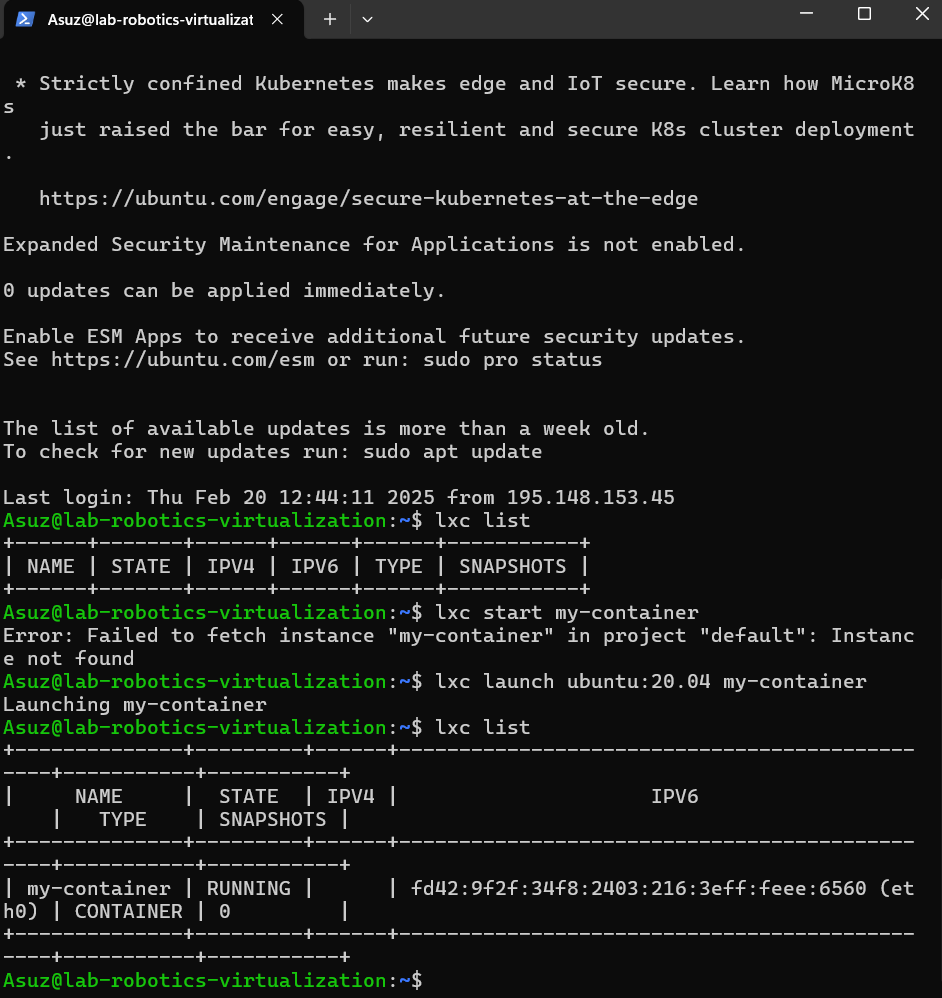


# Part 4: How to Stick Apps with Docker

## **Introduction**
**Docker** is a platform for building, deploying, and managing containerized applications. It allows developers to package applications with all dependencies for consistent execution across environments.

---

## **Installation**
To install Docker on your system, follow these steps:

### **For Ubuntu (Linux)**
```
sudo apt update
sudo apt install -y docker.io
sudo systemctl enable --now docker
sudo usermod -aG docker $USER
newgrp docker
```


## **Basic Concepts**
### **1. Core Docker Components**
| Concept | Description |
|---------|-------------|
| **Image** | A pre-configured environment containing everything needed to run an application. |
| **Container** | A running instance of a Docker image. |
| **Dockerfile** | A script defining how to build a Docker image. |

---

## **Experiment: Docker Hands-On**
### **1. Create a Simple Docker Application**
1. Create a project folder:
   ```
   mkdir my-docker-app && cd my-docker-app
   ```
2. Create a `Dockerfile`:
   ```dockerfile
   # Use Node.js base image
   FROM node:18

   # Set working directory
   WORKDIR /app

   # Copy files
   COPY package.json ./
   RUN npm install
   COPY . .

   # Expose port and start app
   EXPOSE 3000
   CMD ["node", "server.js"]
   ```

3. Build the Docker image:
   ```
   docker build -t my-node-app .
   ```

4. Run the container:
   ```
   docker run -d -p 3000:3000 my-node-app
   ```

5. Access the app:
   Open **http://localhost:3000** in your browser.

   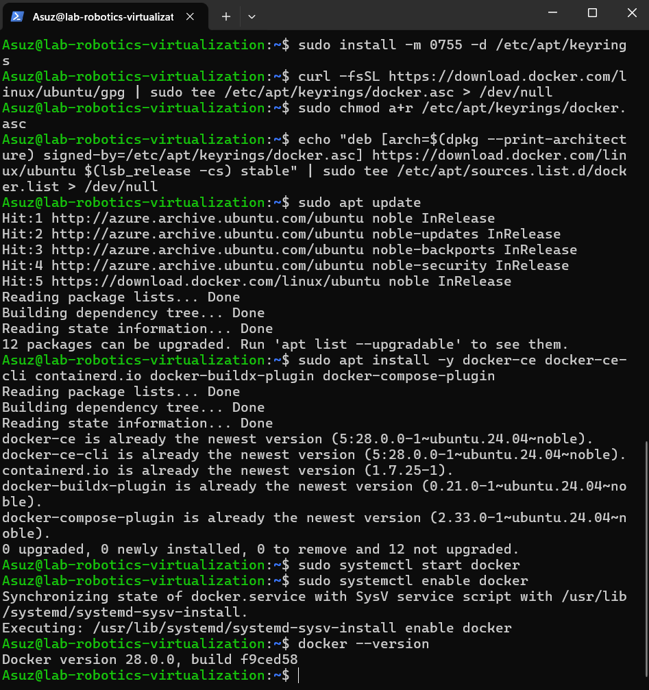
   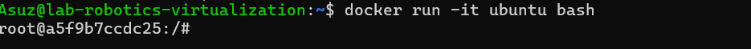
   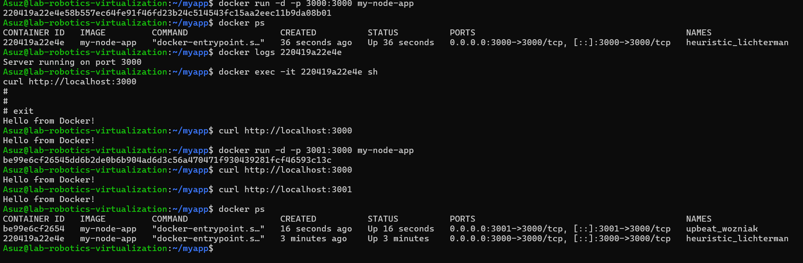

# Part 5: Snaps for Self-Contained Applications

## **Introduction**
**Snaps** are self-contained application packages that include all dependencies, making them portable across different Linux distributions. **Snapcraft** is the tool used to build and manage Snaps.

---

## **Research: Understanding Snaps and Snapcraft**
### **1. What is a Snap?**
- A **Snap** is a software package that contains an application and its dependencies.
- It ensures **consistent execution** across different Linux distributions.
- Snaps run in **isolated environments** for security.

### **2. What is Snapcraft?**
- **Snapcraft** is the tool used to build, publish, and manage Snap packages.
- It simplifies packaging applications into Snaps.

---

## **Installation: Setting Up Snapcraft**
### **For Ubuntu**
Run the following commands to install Snapcraft:
```
sudo apt update
sudo apt install snapcraft -y
```
Alternatively, install Snapcraft using Snap:
```
sudo snap install snapcraft --classic
```

Verify installation:
```
snapcraft --version
```

---

## **Experiment: Creating a Simple Snap**
### **1. Create a Project Directory**
```
mkdir my-snap-app && cd my-snap-app
```

### **2. Create an Application Script**
1. Create a `bin` folder and a script file:
   ```
   mkdir bin
   nano bin/hello-snap
   ```
2. Add the following script:
   ```
   #!/bin/bash
   echo "Hello, Snap!"
   ```
3. Save and exit (Press **CTRL+X**, then **Y**, then **Enter**).

4. Make the script executable:
   ```
   chmod +x bin/hello-snap
   ```

---

### **3. Create the Snapcraft YAML File**
Create a `snapcraft.yaml` file:
```
nano snapcraft.yaml
```
Add the following content:
```yaml
name: my-snap-app
base: core22
version: "1.0"
summary: "A simple Snap application"
description: "This Snap prints 'Hello, Snap!'"

grade: stable
confinement: strict

apps:
  hello:
    command: bin/hello-snap

parts:
  hello:
    plugin: dump
    source: .
```

---

### **4. Build the Snap Package**
Run the following command to build the Snap:
```
snapcraft
```
If prompted, install required dependencies.

---

### **5. Install and Run the Snap**
Once built, install the generated `.snap` file:
```
sudo snap install my-snap-app_1.0_amd64.snap --dangerous
```
The `--dangerous` flag is needed because the Snap is not from the official store.

Run the application:
```
my-snap-app.hello
```
You should see:
```
Hello, Snap!
```

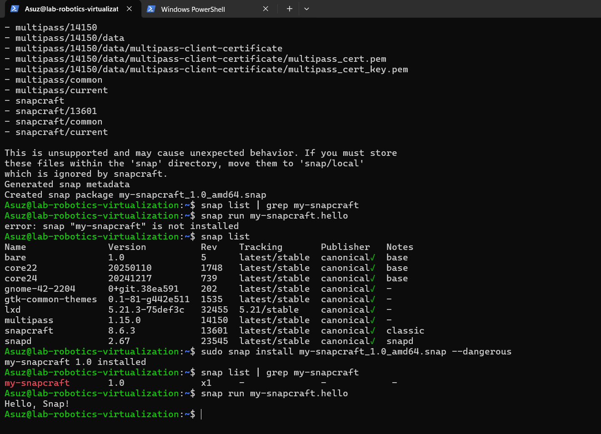


