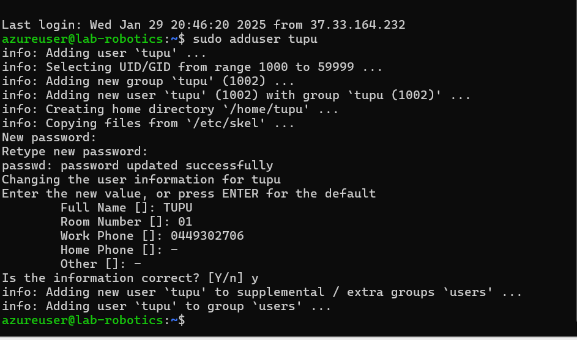
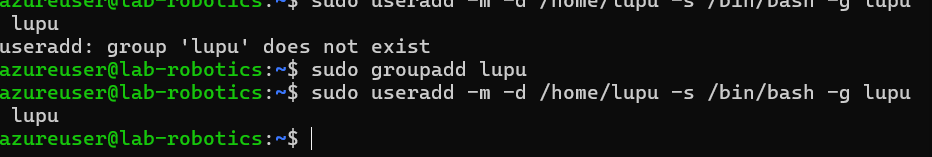
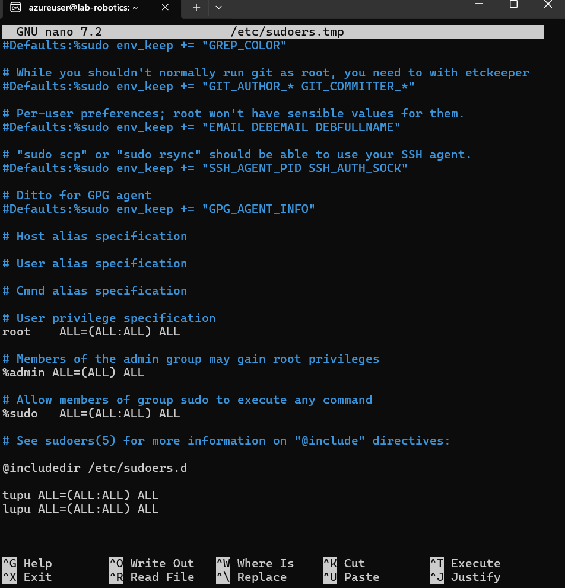
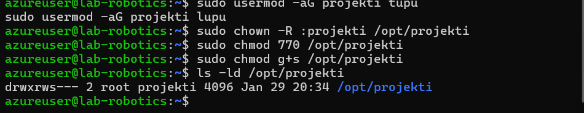

# User and File Access Management Task

This document provides a step-by-step guide for creating users and setting up file access permissions on a Linux system. The task involves creating users, assigning sudo privileges, and setting up a directory with specific access permissions.

1. Create the Tupu user

2. Create the Lupu user

3. Create the Hupu system user

4. Add Tupu and Lupu to the sudo users
Using visudo to edit the sudoers file:

Adding users to the sudo group:

5. Create and set up /opt/projekti directory

## Explanation
Setting the setgid bit ensures that any files or directories created within _/opt/projekti_ will automatically inherit the projekti group ownership. This maintains the desired permission structure.

