# Understanding APT & System Updates

## Part 1: Understanding APT & System Updates (15 min)

### Check your system’s APT version:

1. Run the following command to display the installed APT version:

```
apt --version
```
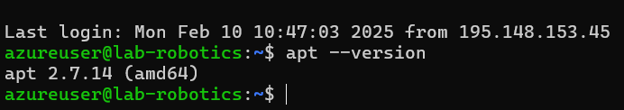
2. Update the package list:

Run the command:
```
sudo apt update
```
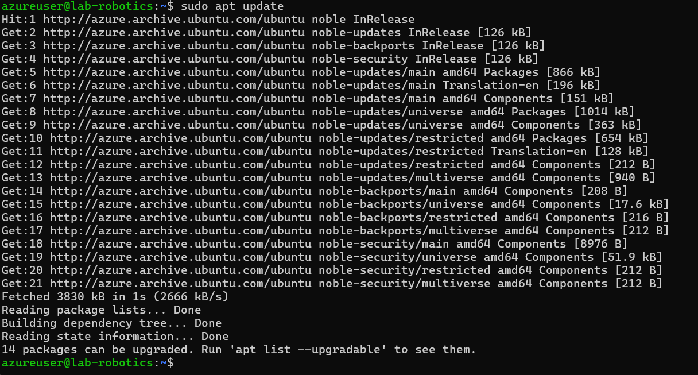
**Explain why this step is important.**

Running sudo apt update is an important step because it updates your local package database.

3. Upgrade installed packages:

```
sudo apt upgrade -y
```
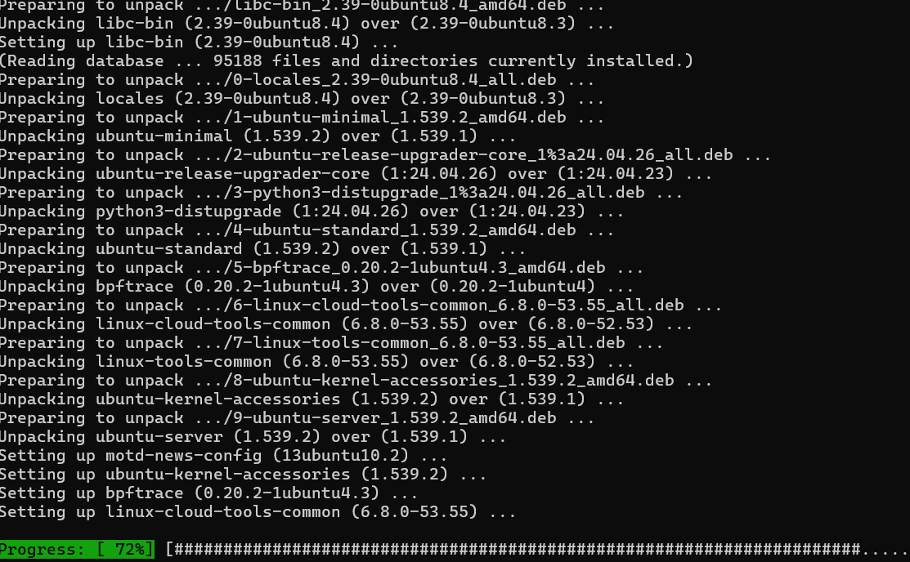
**What is the difference between update and upgrade?**
sudo apt update updates the list of available packages and their versions, while sudo apt upgrade actually installs the newest versions of the packages that are already installed on your system. Both commands work together to keep your system up-to-date and secure.


4. View pending updates (if any):

```
apt list --upgradable
```
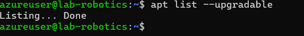

## Part 2: Installing & Managing Packages (20 min)

5. Search for a package using APT:

Find an image editor using:
```
apt search image editor
```
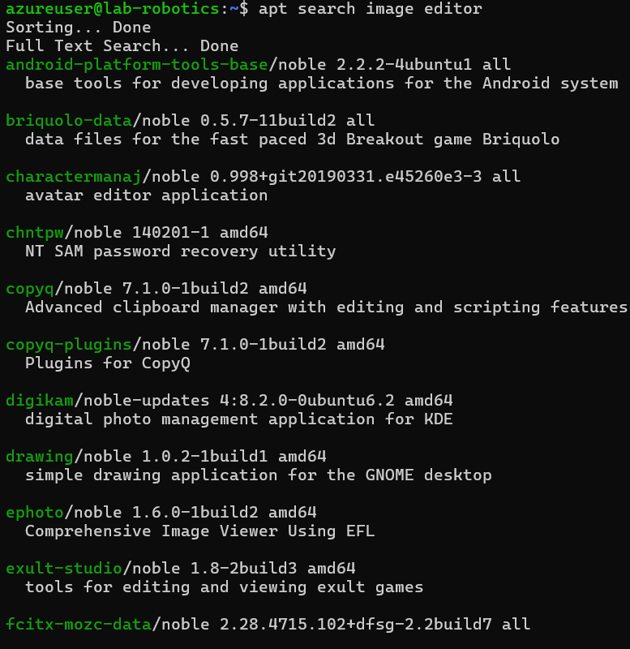

***Pick one package from the list and write down its name.***
 gimp

6.View package details:

Get detailed information about the selected package:
```
apt show <package-name>
```
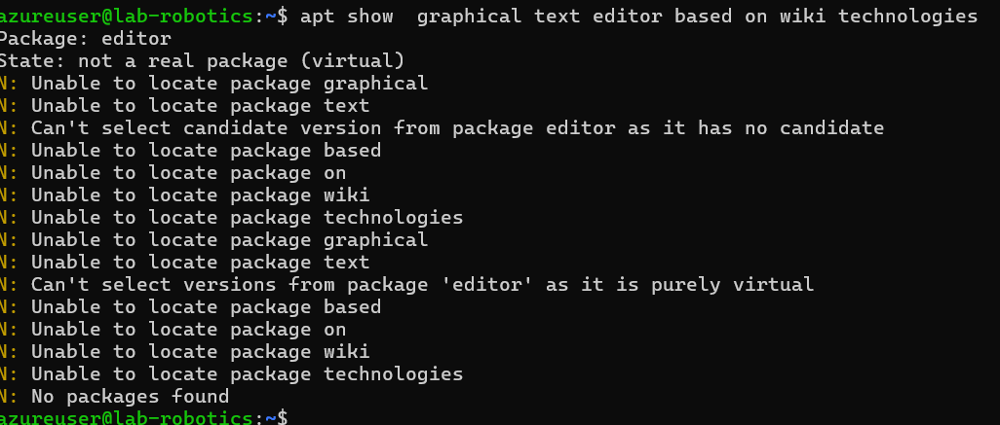

***What dependencies does it require?***

Install the package:

```
sudo apt install <package-name> -y
```
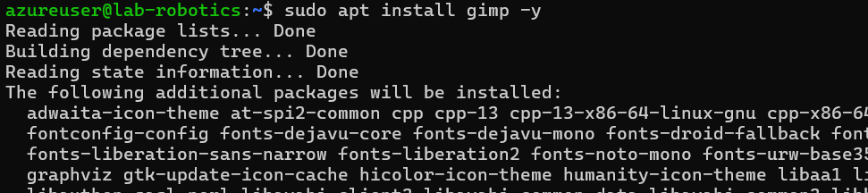

Confirm that the package is successfully installed.
Check installed package version:

```
apt list --installed | grep <package-name>
```
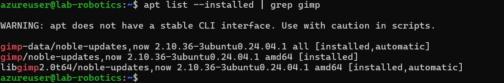
***What version was installed?***
2.10.36

## Part 3: Removing & Cleaning Packages (10 min)
9. Uninstall the package:

```
sudo apt remove <package-name> -y
```
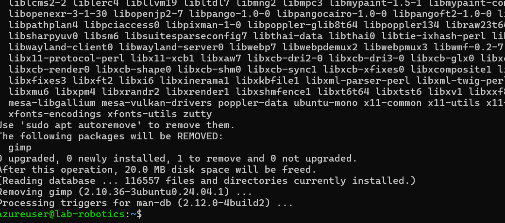
**Is the package fully removed?**
No,_remove_ uninstalls a package but keeps its configuration files
10. Remove configuration files as well:

```
sudo apt purge <package-name> -y
```
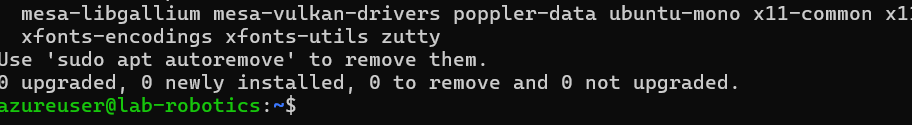

***What is the difference between remove and purge?***
_remove_ uninstalls a package but keeps its configuration files, while _purge_ thoroughly cleans out the package along with its configuration files and settings.

11. Clear unnecessary package dependencies:
```
sudo apt autoremove -y
```
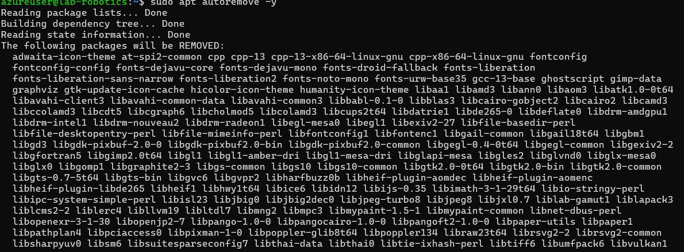
**Why is this step important?**
Running sudo apt autoremove -y is an important step because it helps keep your system clean and efficient by removing unnecessary packages.

12. Clean up downloaded package files:
```
sudo apt clean
```
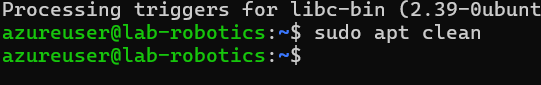
**What does this command do?**
sudo apt clean helps keep your system tidy and saves disk space by removing outdated or unnecessary package files from the local cache.

## Part 4: Managing Repositories & Troubleshooting (15 min)

13. List all APT repositories:
```
cat /etc/apt/sources.list
```
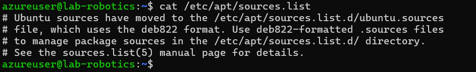
***What do you notice in this file?***
 Ubuntu sources have moved to the /etc/apt/sources.list.d/ubuntu.sources file, which uses the deb822 format. Use deb822-formatted .sources files to manage package sources in the /etc/apt/sources.list.d/ directory.

14. Add a new repository (example: universe repository):
```
sudo add-apt-repository universe
sudo apt update

```
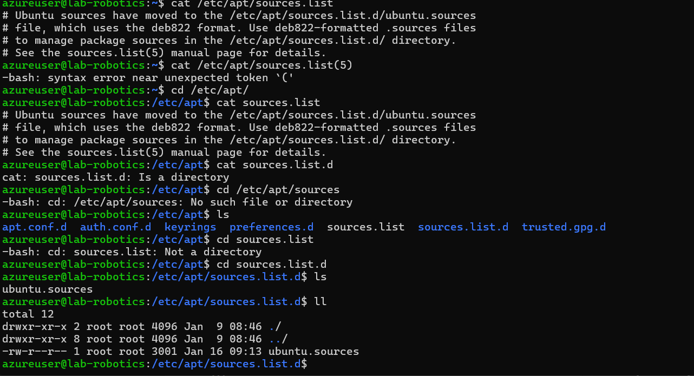
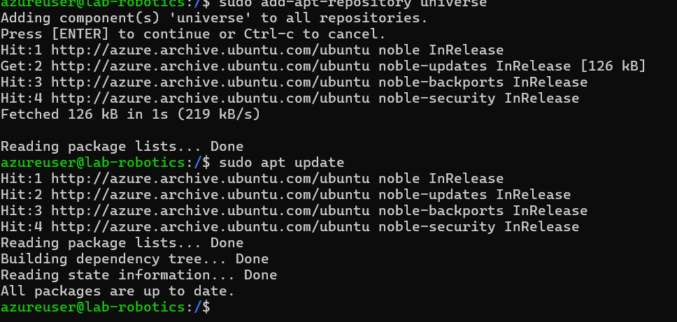

**What types of packages are found in the universe repository?**</br>
The universe repository in Ubuntu includes community-maintained free and open-source software. These packages are not officially supported by Canonical (the company behind Ubuntu), but they are maintained by the community. 

_Additional Software:_ Applications and tools that are not included in the main repository but are still popular and widely used within the community.

_Programming Libraries:_ Various libraries that developers use for programming in different languages and frameworks.

_Utilities:_ Additional utilities and tools that enhance the functionality of your system.

_Games_: A selection of open-source games that you can install and enjoy.

_Development Tools:_ Extra development tools and environments that are useful for software development.

By adding the universe repository, you can expand the range of available software, allowing access and install a variety of community-maintained applications and tools.</br>

15. Simulate an installation failure and troubleshoot:

Try installing a non-existent package:
```
sudo apt install fakepackage
```

**What error message do you get?**
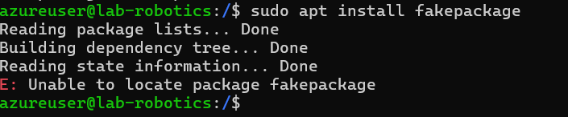
**How would you troubleshoot this issue?**
apt search fakepackage, by using this command , If the package isn't found, it might not be available in the repositories you have added. </br>
If the package is not available in your repositories, you might need to find it from other trusted sources or consider using a different package that provides similar functionality.