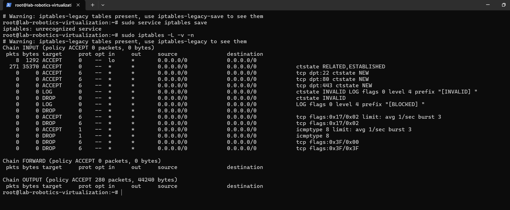

# Firewall Configuration
The firewall rules are implemented using `iptables`. These rules are designed to:

1. Allow SSH, HTTP, and HTTPS traffic.
2. Log all blocked and allowed traffic.
3. Prevent SYN flood attacks.
4. Mitigate other common attack vectors.

### Enable Firewall on Boot
To ensure the firewall rules persist across reboots, we save the rules using the following command:
```
iptables-save > /etc/iptables/rules.v4
```
The firewall rules can be restored at boot by adding the following line to `/etc/rc.local` (or using systemd services for modern Linux distributions):
```
iptables-restore < /etc/iptables/rules.v4
```

## Firewall Rules
### Allow Loopback Traffic
```
iptables -A INPUT -i lo -j ACCEPT
```
**Reason:** This allows internal system processes to communicate without restriction.

### Allow Established and Related Connections
```
iptables -A INPUT -m conntrack --ctstate ESTABLISHED,RELATED -j ACCEPT
```
**Reason:** Ensures that responses to outgoing connections and related traffic are allowed.

### Allow OpenSSH (Port 22)
```
iptables -A INPUT -p tcp --dport 22 -m conntrack --ctstate NEW -j ACCEPT
```
**Reason:** Allows SSH connections for remote management.

### Allow HTTP (Port 80) and HTTPS (Port 443)
```
iptables -A INPUT -p tcp --dport 80 -m conntrack --ctstate NEW -j ACCEPT
iptables -A INPUT -p tcp --dport 443 -m conntrack --ctstate NEW -j ACCEPT
```
**Reason:** Allows access to web services.

### Log and Drop Invalid Packets
```
iptables -A INPUT -m conntrack --ctstate INVALID -j LOG --log-prefix "[INVALID] "
iptables -A INPUT -m conntrack --ctstate INVALID -j DROP
```
**Reason:** Blocks malformed packets that could be part of an attack.

### Log and Drop All Other Incoming Traffic
```
iptables -A INPUT -j LOG --log-prefix "[BLOCKED] "
iptables -A INPUT -j DROP
```
**Reason:** Ensures that all unauthorized traffic is logged and blocked.

## Protection Against Common Attacks
### SYN Flood Mitigation
```
iptables -A INPUT -p tcp --syn -m limit --limit 1/s --limit-burst 3 -j ACCEPT
iptables -A INPUT -p tcp --syn -j DROP
```
**Reason:** Limits the rate of new TCP connections to mitigate SYN flood attacks.

### Prevent Ping of Death
```
iptables -A INPUT -p icmp --icmp-type echo-request -m limit --limit 1/s --limit-burst 3 -j ACCEPT
iptables -A INPUT -p icmp --icmp-type echo-request -j DROP
```
**Reason:** Prevents excessive ICMP Echo Requests that can overwhelm the system.

### Prevent Port Scanning
```
iptables -A INPUT -p tcp --tcp-flags ALL NONE -j DROP
iptables -A INPUT -p tcp --tcp-flags ALL ALL -j DROP
```
**Reason:** Drops packets with suspicious TCP flag configurations used in port scanning.




